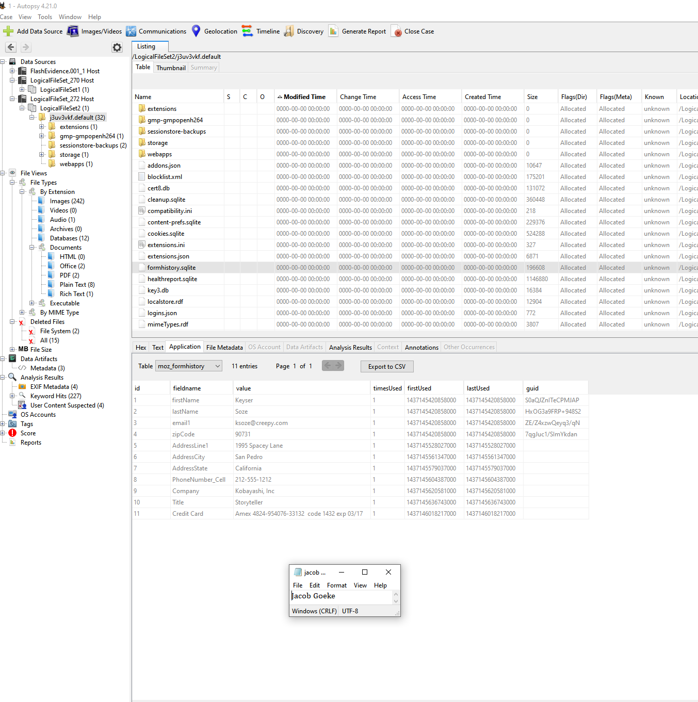
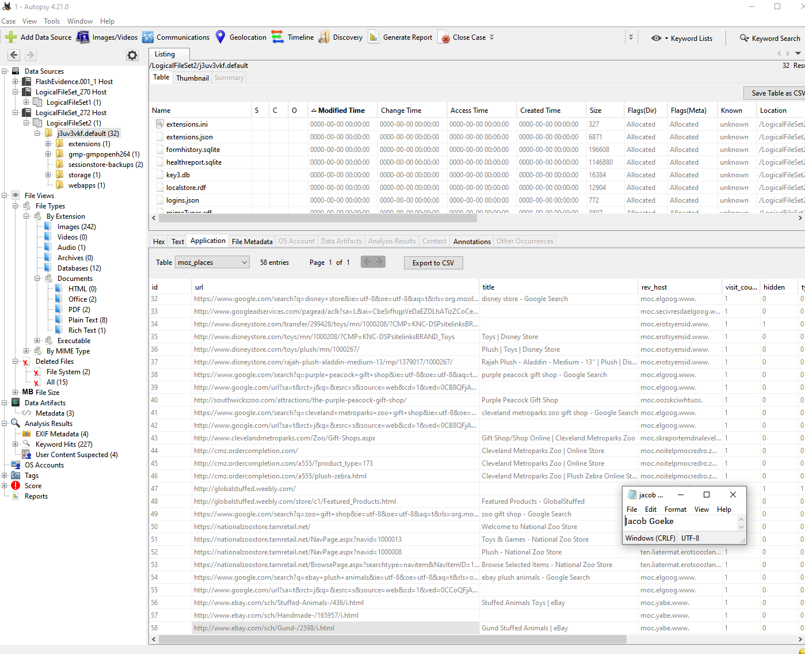
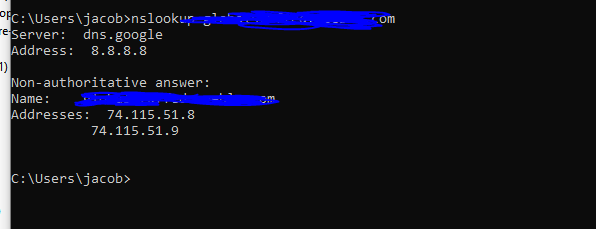
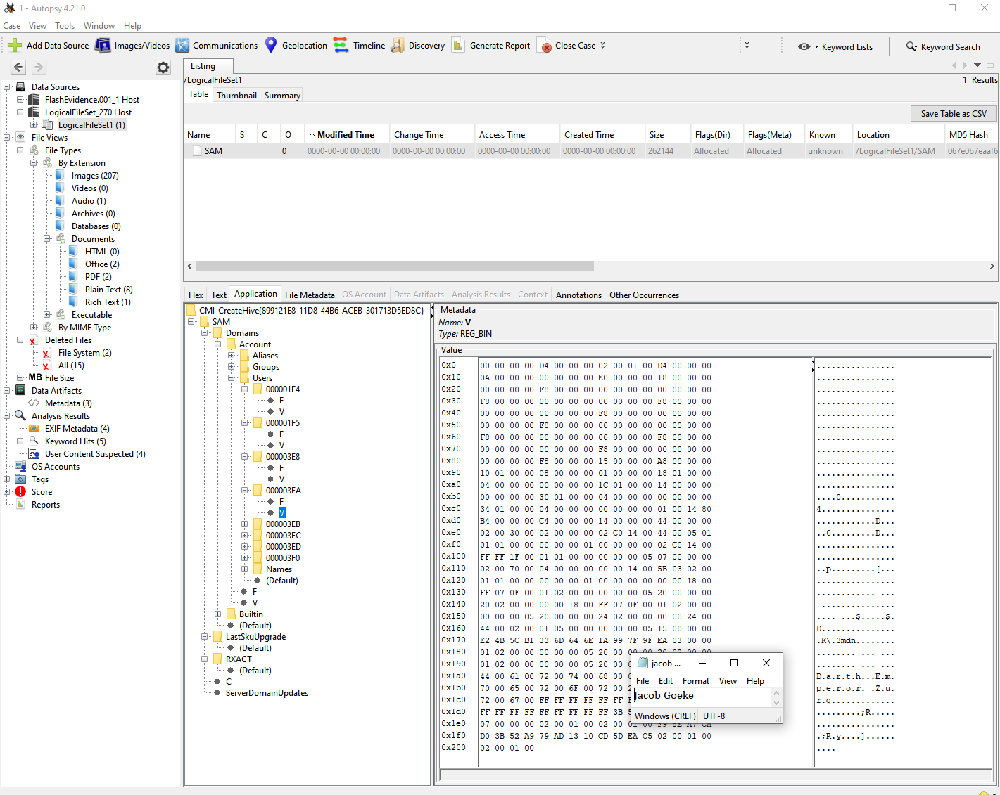
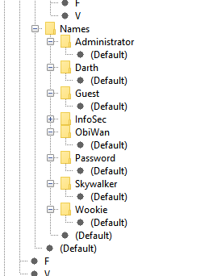
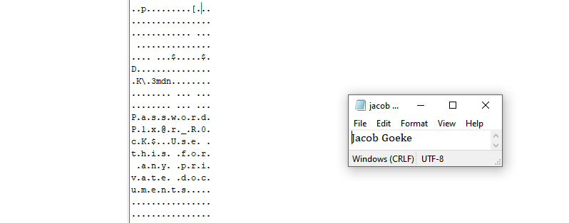
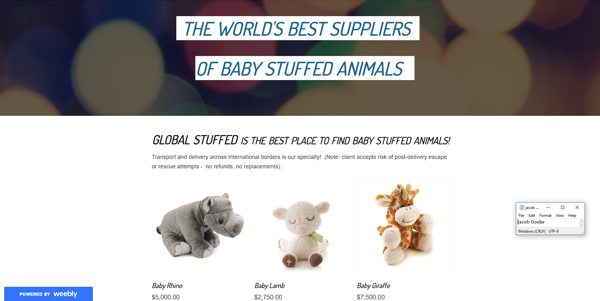

# df-mod6-mobile

## I analyzed the drives, packets, and files found to try to solve the stuffed animal mystery. Mainly using autopsy to view sql files, the SAM file, and an image of a drive, I was able to find some useful information in the attached screenshots.

